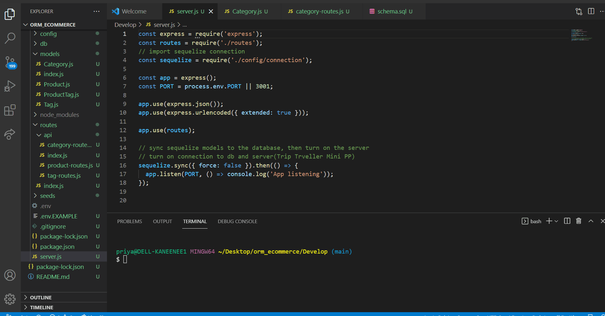

# orm_ecommerce
* This HW ecommerce backend looks like a practice session  for the upcoming Project 2 where Routes may have to be tested on Insomnia or Postman  by Backend team.
* Env files to store db name ,root name ,password has been created and assigned to  .gitignore
* The output files show the DB content and how the  category ,prpduct and tag routes work on Insonia and how the Database reflects the changes.
* When I Open API GET routes in Insomnia  for categories, products, or tags==>THEN the data for each of these routes is displayed in a formatted JSON
* WHEN I test API POST(CREATE NEW), PUT(UPDATE EXISTING), and DELETE routes in Insomnia Core==>THEN I am able to successfully create, update, and delete data in my database

* Visual output Database Populated/Seeded 

* CATEGORY routes -for getall ,get one by id ,create(post) a new category ,update(put) a category by id and delete a category by id

* TAG routes with GET ,POST ,PUT ,DEL

* PRODUCT routes 

